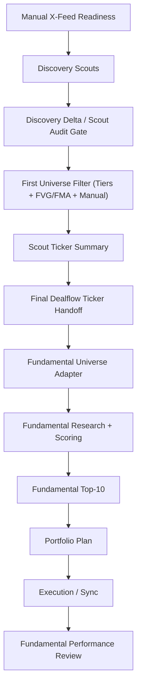

# Aeternus Daily Pipeline Debug Runbook

Use this at the **start of every run** and when debugging the pipeline intraday.

The goal is simple:

- understand the flow in the same order every time
- know which stage is discovery vs collection vs filtering vs research
- know which artifact proves a stage worked
- know which gate blocked or degraded the run

## Golden Rule

Do not treat the pipeline as one black box.

Treat it as a sequence of distinct stages:

1. `X-feed manual readiness`
2. `Other scouts / discovery`
3. `Scout audit gate`
4. `First universe filter`
5. `Collectors`
6. `Collector audit gate`
7. `Second universe filter`
8. `Deep research selection`
9. `Research execution`
10. `Portfolio plan`
11. `Execution / sync`
12. `Hindsight / performance review`

If something looks wrong downstream, debug upstream first.

## Actual Flow



## Stage 0: Preflight

Before touching the pipeline, lock in the run context:

- date
- mode: `manual`, `daily`, `event`, or `auto`
- whether manual X-feed is required
- whether this is a dry/debug run or a capital-bearing run

Useful commands:

```bash
python3 -m cli.main x-feed --status --date YYYY-MM-DD
python3 -m cli.main discover --date YYYY-MM-DD --format json
python3 -m cli.main collect --date YYYY-MM-DD --top-k 20 --format json
python3 -m cli.main workflow-run --mode manual --date YYYY-MM-DD --skip-execution --skip-sync --format json
```

## Stage 1: Manual X-Feed Readiness

### What this stage is

This is a **workflow preflight**, not just another signal source.

For `workflow-run --mode manual`, X-feed must be complete before the run should proceed.

### Command

```bash
python3 -m cli.main x-feed --status --date YYYY-MM-DD
```

### Pass condition

- status is `READY`
- `16/16` required passes are present
- merged symbol count is non-zero

### Artifact

- `eval_results/x_feed/YYYY-MM-DD/raw/pass_*.json`
- `eval_results/x_feed/YYYY-MM-DD/merged.json`

### Failure mode

- If this is incomplete, **stop here**
- Do not continue manual-mode workflow runs until this stage is green

## Stage 2: Discovery Scouts

### What this stage is

This is the **new-information discovery layer**.

These are the things that should find or activate names from fresh state change:

- breakout discovery
- IV scanner
- insider sweep
- manual X-feed merge
- `FVG_RECALL`
- `FMA_RECALL`
- background scouts like commodity shock / DoD where applicable

This stage happens in `discover()`, before the universe is finalized.

Relevant code:

- [tradingagents/dealflow/pipeline.py](/Users/aeternusholdings/Documents/AeternusAgents-opus46/tradingagents/dealflow/pipeline.py)
- [tradingagents/dealflow/akg_universe.py](/Users/aeternusholdings/Documents/AeternusAgents-opus46/tradingagents/dealflow/akg_universe.py)

### Command

```bash
python3 -m cli.main discover --date YYYY-MM-DD --format json
```

### Pass condition

- `discover()` completes
- universe size is non-zero
- discovery artifacts are written
- no critical scout failed silently

### Artifacts

- `eval_results/deal_flow/YYYY-MM-DD/scout_audit.json`
- `eval_results/deal_flow/YYYY-MM-DD/fvg_recall.json`
- `eval_results/deal_flow/YYYY-MM-DD/fma_recall.json`
- `eval_results/deal_flow/YYYY-MM-DD/discovery_delta.json`

## Stage 3: Scout Audit Gate

### What this stage is

This is the **read-only measurement layer** for discovery quality.

It answers:

- did scouts fire?
- which names are `scout_only`, `technical_only`, or `multi_channel`?
- did discovery look broad and healthy, or thin and suspicious?

### Same-day checks

Inspect:

- `discovery_delta.json`
- `scout_audit.json`

Look for:

- non-zero `top_delta_symbols`
- non-empty `multi_channel` cohort
- sensible `coverage_summary`

### Later review checks

Use:

```bash
python3 -m cli.main hindsight --source-date YYYY-MM-DD
python3 -m cli.main performance-review --source-date YYYY-MM-DD
python3 -m cli.main stage-diagnosis --last 30
```

## Stage 4: First Universe Filter

### What this stage is

This is the first stock-selection boundary after discovery.

The universe builder currently unions:

- `T1_ANCHOR`
- `T2_NEIGHBOR`
- `T3_SCOUT`
- `T3B_FVG_RECALL`
- `T3C_FMA_RECALL`
- `T4_DARK`
- `T5_RESCAN`
- `T6_PORTFOLIO`
- `MANUAL`

### Important distinction

This stage is not “all scouts only looked at N names.”

This stage is:

- scouts and recall channels fired first
- then the universe builder assembled the bounded set that later collectors will evaluate

### Pass condition

- the filtered universe exists
- tier mix looks sane
- no single tier is accidentally dominating

### Artifacts / diagnostics

- universe ledger rows written into the stage ledger
- workflow console output for tier counts
- later `stage-diagnosis` should reveal whether `universe_gate_edge` or `universe_gate_haystack` is the leak

## Stage 5: Scout Handoff

### What this stage is

This is the **scout-only ticker handoff layer**. It dedupes names found by X/manual and automated scouts. It does not rank, score, candidate_list, or allocate research budget.

Current scout inputs include:

- X manual feed
- breakout scan
- IV force queue
- insider cluster
- technical ignition
- 13F watchlist
- FVG/FMA recall

Relevant code:

- [tradingagents/dealflow/pipeline.py](/Users/aeternusholdings/Documents/AeternusAgents-opus46/tradingagents/dealflow/pipeline.py)
- [tradingagents/dealflow/scout_ticker_summary.py](/Users/aeternusholdings/Documents/AeternusAgents-opus46/tradingagents/dealflow/scout_ticker_summary.py)

### Command

```bash
python3 -m cli.main collect --date YYYY-MM-DD --format json
```

### Pass condition

- scout artifacts are read
- scout ticker totals are written
- final ticker handoff is written
- handoff contains no pre-fundamental score/rank fields

### Artifacts

- `eval_results/deal_flow/YYYY-MM-DD/scout_ticker_summary.json`
- `eval_results/deal_flow/YYYY-MM-DD/final_dealflow_tickers.json`
- `eval_results/deal_flow/YYYY-MM-DD/final_dealflow_tickers.txt`
- `eval_results/deal_flow/latest_final_dealflow_tickers.json`

## Stage 6: Scout Handoff Audit

### What this stage is

This is where you confirm dealflow stayed scout-only.

The only supported dealflow question now is: which tickers did scouts find, and which scouts found them?

### Pass condition

- total ticker count is non-zero when scouts found names
- per-scout counts match source artifacts
- overlap metadata is visible
- no scoring fields exist in scout handoff

### Debug question

If a ticker is missing, ask:

- did a scout artifact omit it?
- or did ticker normalization drop it?

## Stage 7: Fundamental Entry

### What this stage is

This is the first place scout-sourced tickers may enter a scoring framework. The adapter converts the ticker handoff into a fundamental universe CSV with CIK resolution and scout provenance only.

### Pass condition

- universe CSV row count equals handoff ticker count minus unresolved hard failures
- columns include ticker, CIK, quarter, source stage, and scout metadata
- columns do not include pre-fundamental score/rank fields

### Artifacts

- `eval_results/fundamental/YYYY-MM-DD/dealflow_universe.csv`

## Stage 8: Fundamental Research

### What this stage is

This is where scoring, ranking, and underwriting can happen. Any ticker score here belongs to the fundamental framework, not dealflow.

### Debug question

If a name scores badly, ask:

- did the fundamental data support the scout thesis?
- or was the scout discovery useful but not investable?

## Stage 9: Fundamental Output Handoff

### Artifacts

- fundamental recommendation outputs
- Top-10 daily recommendation when requested
- downstream portfolio inputs only after fundamental scoring exists

## Fundamental Top-10 daily handoff

Run this after the dealflow framework has finalized the day's ticker handoff and the fundamental framework has produced final scores.

Inputs:

- `eval_results/deal_flow/YYYY-MM-DD/final_dealflow_tickers.json`
- `eval_results/fundamental/YYYY-MM-DD/fundamental_final_scores_YYYY-MM-DD.csv` or the run-specific final-scores CSV

Command:

```bash
python3 -m cli.main fundamental-top10 \
  --scores-csv eval_results/fundamental/YYYY-MM-DD/fundamental_final_scores_YYYY-MM-DD.csv \
  --output-root eval_results/fundamental/YYYY-MM-DD \
  --date YYYY-MM-DD \
  --top-n 10
```

Outputs:

- `eval_results/fundamental/YYYY-MM-DD/high_conviction_top10.csv`
- `eval_results/fundamental/YYYY-MM-DD/high_conviction_top10.json`
- `eval_results/fundamental/YYYY-MM-DD/high_conviction_top10_daily_recommendation.md`

Operating rule: use `high_conviction_top10_v2_final` as observed-data v2, not fully validated AKG+macro v2. Prioritize `rm_signal_bucket=1` as the single-RM-signal bucket; be cautious with `rm_signal_bucket=2+` and HP names unless LLM/theme/valuation evidence is strong. Apply macro permission manually until PIT macro history is validated. Continue forward-validating AKG theme acceleration / T5_RESCAN because historical PIT fields are blank.

## Fundamental Top-15 + right-tail visibility daily handoff

Run Top-15 after Top-10 when the PM wants the core plus right-tail exception/starter-underwriting sleeve:

```bash
python3 -m cli.main fundamental-top15 \
  --scores-csv eval_results/fundamental/YYYY-MM-DD/fundamental_final_scores_YYYY-MM-DD.csv \
  --output-root eval_results/fundamental/YYYY-MM-DD \
  --date YYYY-MM-DD
```

Then run visibility queues:

```bash
python3 -m cli.main fundamental-right-tail-queues \
  --scores-csv eval_results/fundamental/YYYY-MM-DD/fundamental_final_scores_YYYY-MM-DD.csv \
  --top15-selected-csv eval_results/fundamental/YYYY-MM-DD/high_conviction_top15.csv \
  --output-root eval_results/fundamental/YYYY-MM-DD \
  --date YYYY-MM-DD
```

Default Top-15 output:

- `core_deterioration_review_queue.csv` core names requiring manual review before buy-underwriting; strict rows move to scout/review unless PM overrides

Default right-tail visibility outputs:

- `top15_exception_candidate_queue.csv`
- `right_tail_scout_queue.csv`
- `demote_review_queue.csv` full audit queue
- `demote_review_priority_1.csv` daily PM demote-review view
- `demote_review_priority_2.csv`
- `demote_review_low_priority.csv`
- `thin_signal_watchlist_queue.csv` full audit queue
- `thin_signal_watchlist_top100.csv` daily PM thin-signal view; use Top 25 / Top 50 / Top 100 cuts
- `right_tail_evidence_score_diagnostics.csv`
- `right_tail_queues.json`

Daily review order:

1. Top-15 core / exception names
2. `core_deterioration_review_queue.csv`
3. `right_tail_scout_queue.csv`
4. `demote_review_priority_1.csv`
5. top-ranked names from `thin_signal_watchlist_top100.csv`

Do not treat scout, demote-review, or thin-signal queues as buy lists. Approved live use is visibility/research only after Top-15 selection is frozen. Full production-v2 historical validation still depends on PIT AKG/theme/macro provenance; missing provenance should remain visible in audit artifacts, not silently neutralized.

Optional historical/debug target audit:

```bash
python3 -m cli.main fundamental-right-tail-queues \
  --scores-csv eval_results/fundamental/YYYY-MM-DD/fundamental_final_scores_YYYY-MM-DD.csv \
  --top15-selected-csv eval_results/fundamental/YYYY-MM-DD/high_conviction_top15.csv \
  --target-events-csv docs/research/right_tail_target_events.csv \
  --output-root eval_results/fundamental/YYYY-MM-DD \
  --date YYYY-MM-DD
```

Without `--target-events-csv`, no `target_miss_rescue_audit.csv` is written in daily live mode. These queues are visibility/fundamental review lists, not buy lists.

## Stage 10: Research Execution

### What this stage is

This is where fundamental-intake turns into actual analysis output.

Relevant command:

```bash
python3 -m cli.main retired post-scout batch command --run-date YYYY-MM-DD --include-unselected --quick-unselected
```

### Pass condition

- analysis summary exists
- success/failure/cached split is visible
- deep path and quick path are distinguishable

### Artifacts

- batch summary under `eval_results/deal_flow/YYYY-MM-DD/`
- `eval_results/deal_flow/YYYY-MM-DD/research_conversion_integrity.json`

### Debug question

Did deep-selected names actually become usable analyses, or did the run degrade into cached fallbacks and failures?

## Stage 11: Portfolio Plan

### What this stage is

This is where research turns into capital allocation.

Relevant command:

```bash
python3 -m cli.main portfolio-plan --run-date YYYY-MM-DD --capital-usd 100000 --max-positions 8
```

### Pass condition

- plan exists
- benchmark hurdle metadata is present
- portfolio inclusion is explainable

### Debug question

Which names were blocked by:

- score/confidence
- V3 benchmark hurdle
- long-only / position limits

## Stage 12: Execution / Sync

### What this stage is

This is downstream portfolio/execution state management.

For debug runs, it is often correct to stop before this stage:

```bash
python3 -m cli.main workflow-run --mode manual --date YYYY-MM-DD --skip-execution --skip-sync --format json
```

Use live execution only when the earlier gates are green.

## Stage 13: Hindsight / Performance / Diagnosis

### What this stage is

This is the learning loop.

Use:

```bash
python3 -m cli.main hindsight --source-date YYYY-MM-DD
python3 -m cli.main performance-review --source-date YYYY-MM-DD
python3 -m cli.main stage-diagnosis --last 30
```

### What to look at

- scout hit rate
- fundamental conversion rate
- forward returns after fundamental recommendations
- future winner recall after research scoring

If you are not running these, you are not closing the loop.

## Daily Operator Checklist

Use this exact order:

1. Check manual X-feed readiness.
2. Run `discover`.
3. Inspect `scout_audit.json`, `fvg_recall.json`, `fma_recall.json`, `discovery_delta.json`.
4. Confirm the first universe filter looks sane.
5. Run `collect`.
6. Inspect `scout_ticker_summary.json` and `final_dealflow_tickers.json`.
7. Confirm dealflow handoff has ticker metadata only.
8. Run the fundamental framework on the finalized ticker handoff when daily fundamental Top-10 is needed.
9. Run `fundamental-top10` and inspect `high_conviction_top10_daily_recommendation.md`.
10. Run portfolio planning only after fundamental output exists.
11. Run execution/sync only if this is a capital-bearing run.
12. Run fundamental performance review after enough forward time has passed.

## What To Debug First

If today’s run looks wrong:

- wrong names missing entirely:
  - debug `X-feed`, discovery scouts, `FVG_RECALL`, `FMA_RECALL`, and the first universe filter

- names present but not scored:
  - debug fundamental adapter and CIK resolution

- good names rejected after research:
  - debug fundamental framework assumptions

- research budget spent on the wrong names:
  - debug Fundamental Intake Integrity

- research output weak or too cached:
  - debug Research Conversion Integrity

- plan weaker than expected:
  - debug portfolio hurdle / inclusion logic

## Current Architectural Truth

The pipeline is now instrumented well enough that the next gains should come from:

- real forward-testing evidence
- stage-by-stage diagnosis
- changing the specific stage that is leaking alpha

Not from treating the whole system as one opaque model.
