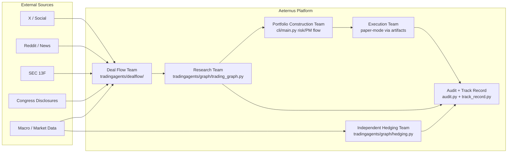
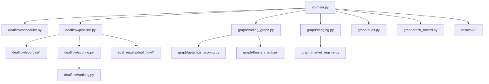
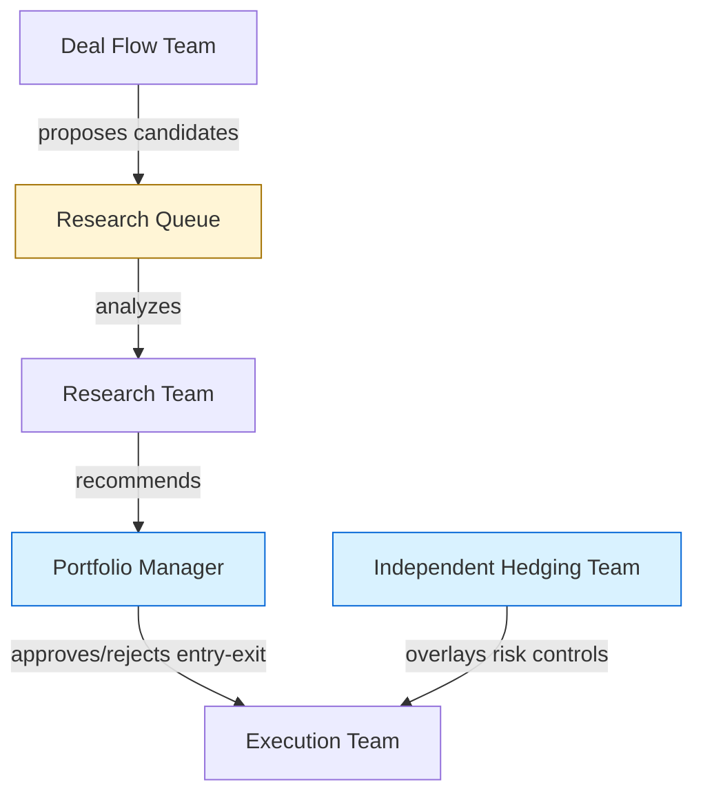
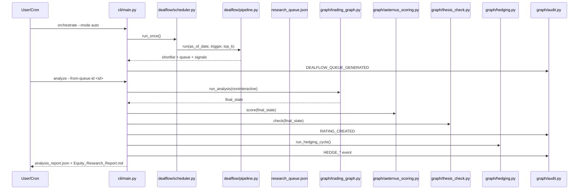
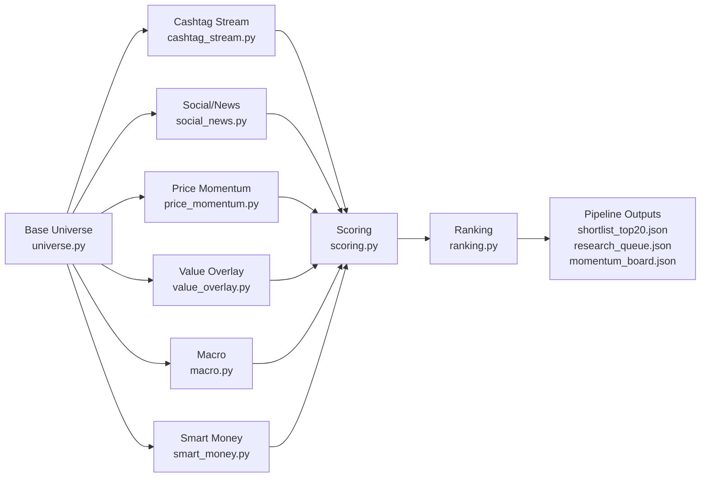
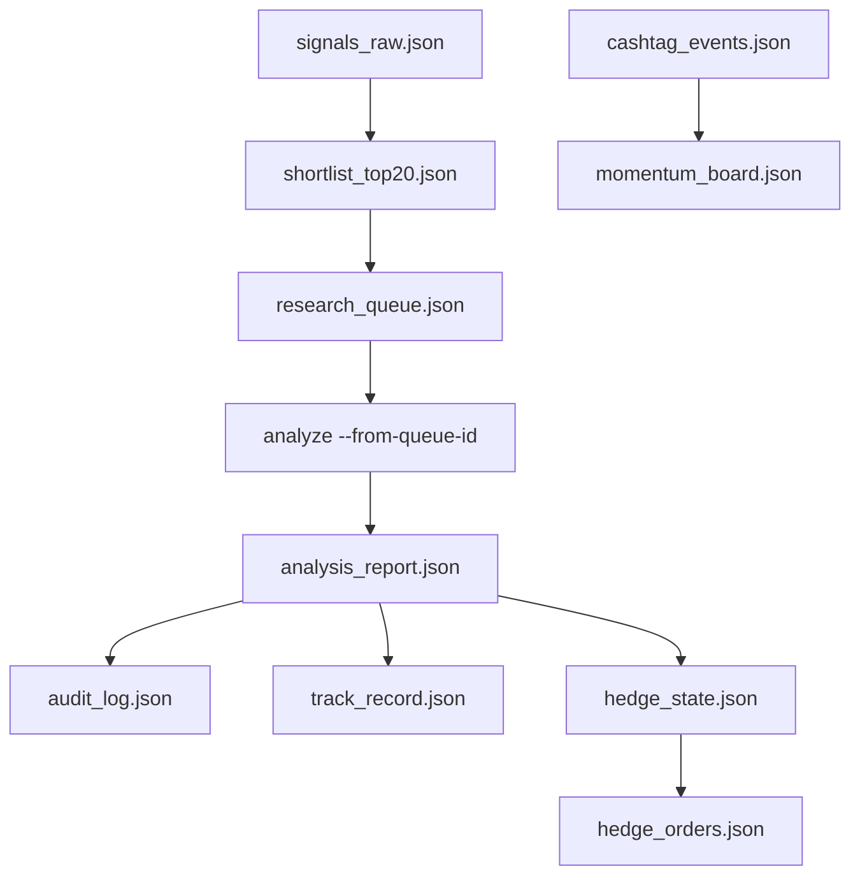
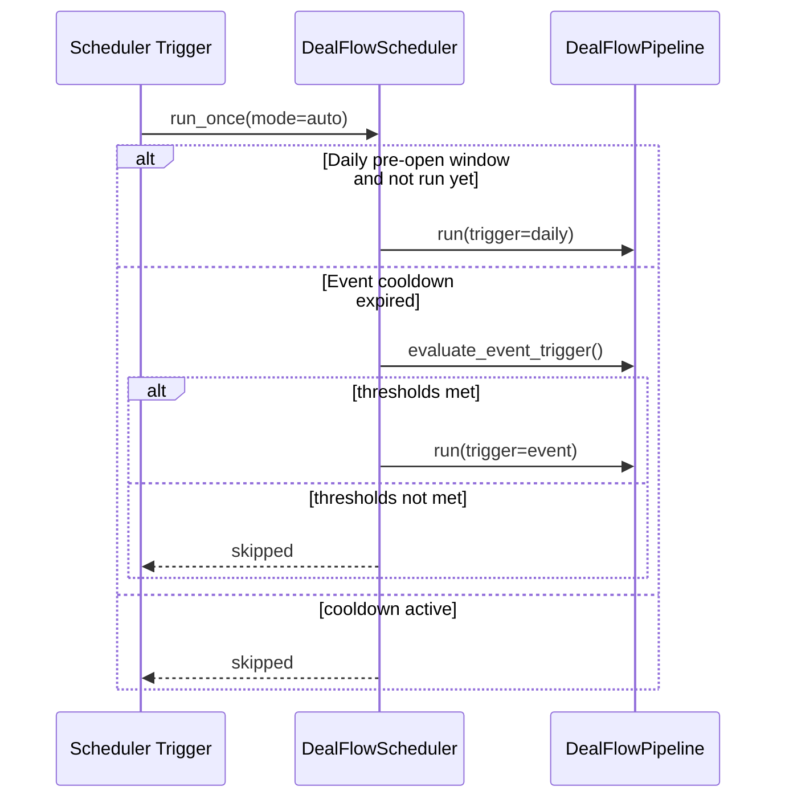

# DeepWiki: Aeternus System Architecture

Version: `2026-02-06`
Scope: `As-Is + Target-State`
Primary workspace: `/Users/aeternusholdings/Documents/AeternusAgentsAG`

## Executive Overview

### As-Is

The current platform is a documentation-backed, CLI-driven investment intelligence system where:
- Deal flow generation is implemented in `/Users/aeternusholdings/Documents/AeternusAgentsAG/tradingagents/dealflow/pipeline.py` and exposed via `/Users/aeternusholdings/Documents/AeternusAgentsAG/cli/main.py` (`source`, `queue`, `orchestrate`, `analyze --from-queue-id`).
- Multi-agent research/recommendation is orchestrated by `/Users/aeternusholdings/Documents/AeternusAgentsAG/tradingagents/graph/trading_graph.py` and executed from `/Users/aeternusholdings/Documents/AeternusAgentsAG/cli/main.py` (`analyze`).
- Rating generation and thesis comparison are implemented in `/Users/aeternusholdings/Documents/AeternusAgentsAG/tradingagents/graph/aeternus_scoring.py` and `/Users/aeternusholdings/Documents/AeternusAgentsAG/tradingagents/graph/thesis_check.py`.
- Hedging overlay is implemented in `/Users/aeternusholdings/Documents/AeternusAgentsAG/tradingagents/graph/hedging.py` and `/Users/aeternusholdings/Documents/AeternusAgentsAG/tradingagents/graph/market_regime.py`.
- Audit and track record persistence are implemented in `/Users/aeternusholdings/Documents/AeternusAgentsAG/tradingagents/graph/audit.py` and `/Users/aeternusholdings/Documents/AeternusAgentsAG/tradingagents/graph/track_record.py`.

### Target-State

A fully automated operating stack where:
- Deal flow runs continuously across social/news/macro/smart-money connectors and emits ranked research queues.
- Research recommendations flow into portfolio construction policies and then into execution adapters (paper first, live later).
- Hedging runs independently as a risk overlay with explicit rebalance controls and attribution.
- All critical transitions are auditable and attributable end-to-end.

## System At A Glance





### As-Is

The implemented runtime starts from CLI commands in `/Users/aeternusholdings/Documents/AeternusAgentsAG/cli/main.py`, with deal flow and research producing artifacts under `/Users/aeternusholdings/Documents/AeternusAgentsAG/eval_results/` and `/Users/aeternusholdings/Documents/AeternusAgentsAG/results/`.

### Target-State

The same topology remains, but execution migrates from artifact-only intent to live broker API integrations while preserving audit guarantees.

## Team Topology And Decision Rights



### As-Is

Decision authority in code is:
- Deal flow proposes queue items in `/Users/aeternusholdings/Documents/AeternusAgentsAG/tradingagents/dealflow/pipeline.py`.
- Research recommends through debate + PM judgment in `/Users/aeternusholdings/Documents/AeternusAgentsAG/tradingagents/graph/trading_graph.py` and rendered in `/Users/aeternusholdings/Documents/AeternusAgentsAG/cli/main.py`.
- Entry/exit decision authority is represented by portfolio-manager decision text in `/Users/aeternusholdings/Documents/AeternusAgentsAG/cli/main.py` (risk debate + final decision path).
- Execution is currently paper-mode/artifact mode (no broker order adapter in repo).
- Hedging applies an independent control loop in `/Users/aeternusholdings/Documents/AeternusAgentsAG/tradingagents/graph/hedging.py`.

### Target-State

Keep the same authority boundaries, but attach PM-approved decisions to explicit execution order objects and broker adapters.

## End-to-End Lifecycle



### As-Is

The daily/event lifecycle is implemented via:
- `/Users/aeternusholdings/Documents/AeternusAgentsAG/cli/main.py`
- `/Users/aeternusholdings/Documents/AeternusAgentsAG/tradingagents/dealflow/scheduler.py`
- `/Users/aeternusholdings/Documents/AeternusAgentsAG/tradingagents/dealflow/pipeline.py`
- `/Users/aeternusholdings/Documents/AeternusAgentsAG/tradingagents/graph/*`

### Target-State

Add a first-class execution service after PM approval and before lifecycle closure.

## Deal Flow Architecture



### As-Is

Implemented components:
- Contracts: `/Users/aeternusholdings/Documents/AeternusAgentsAG/tradingagents/dealflow/contracts.py`
- Pipeline orchestration: `/Users/aeternusholdings/Documents/AeternusAgentsAG/tradingagents/dealflow/pipeline.py`
- Dynamic universe expansion: `/Users/aeternusholdings/Documents/AeternusAgentsAG/tradingagents/dealflow/universe.py`
- Source modules: `/Users/aeternusholdings/Documents/AeternusAgentsAG/tradingagents/dealflow/sources/`
- Scoring model + lane assignment: `/Users/aeternusholdings/Documents/AeternusAgentsAG/tradingagents/dealflow/scoring.py`
- Ranking + diversification constraints: `/Users/aeternusholdings/Documents/AeternusAgentsAG/tradingagents/dealflow/ranking.py`

Momentum and lane policy implemented:
- `12 CORE / 8 MOMENTUM` shortlist split in `/Users/aeternusholdings/Documents/AeternusAgentsAG/tradingagents/dealflow/ranking.py`
- `4 CORE / 4 MOMENTUM` deep-selection split in `/Users/aeternusholdings/Documents/AeternusAgentsAG/tradingagents/dealflow/pipeline.py`
- weak-value/high-momentum candidates remain eligible; risk tagging includes `Valuation stretched` in `/Users/aeternusholdings/Documents/AeternusAgentsAG/tradingagents/dealflow/scoring.py`

X cost-control architecture implemented:
- Mode: `HYBRID|DIRECT_ONLY|SCOUT_ONLY` in `/Users/aeternusholdings/Documents/AeternusAgentsAG/tradingagents/default_config.py`
- Budget + call caps: `dealflow_x_daily_budget_usd`, `dealflow_x_max_api_calls_per_run`, `dealflow_x_cost_per_api_call_usd`
- Deterministic fallback when X/LLM unavailable in `/Users/aeternusholdings/Documents/AeternusAgentsAG/tradingagents/dealflow/sources/cashtag_stream.py`

### Target-State

- Increase source breadth (direct Reddit hardening, expanded congress feeds, broader influencer graph quality model).
- Promote queue generation to scheduled autonomous operation with service-level metrics and alerting.

## Research/Recommendation Architecture

### As-Is

Research orchestration is implemented in `/Users/aeternusholdings/Documents/AeternusAgentsAG/tradingagents/graph/trading_graph.py` with:
- Analyst team tooling (`market`, `social`, `news`, `fundamentals` tool nodes).
- Debate and PM judgment state transitions through graph setup/propagation modules under `/Users/aeternusholdings/Documents/AeternusAgentsAG/tradingagents/graph/`.
- Scoring + rating object generation in `/Users/aeternusholdings/Documents/AeternusAgentsAG/tradingagents/graph/aeternus_scoring.py`.
- Daily thesis comparator in `/Users/aeternusholdings/Documents/AeternusAgentsAG/tradingagents/graph/thesis_check.py`.

Queue-driven research entrypoint is implemented in `/Users/aeternusholdings/Documents/AeternusAgentsAG/cli/main.py` (`analyze --from-queue-id`).

### Target-State

- Batch deep research execution across all selected queue items in one command.
- Add explicit research strategy templates and confidence calibration loops.

## Portfolio Construction + Execution Architecture

### As-Is

Portfolio construction and final decision rendering are implemented in `/Users/aeternusholdings/Documents/AeternusAgentsAG/cli/main.py` as part of the risk debate and portfolio manager decision flow.

Execution status:
- No live broker order placement module is present in `/Users/aeternusholdings/Documents/AeternusAgentsAG/tradingagents/`.
- The current system persists decisions and outcomes through reports and audit/track-record artifacts.

### Target-State

- Introduce explicit order-intent contracts and execution adapters (paper/live).
- Keep PM as final gate before execution submission.

## Independent Hedging Architecture

### As-Is

Hedge engine is implemented in:
- `/Users/aeternusholdings/Documents/AeternusAgentsAG/tradingagents/graph/hedging.py`
- `/Users/aeternusholdings/Documents/AeternusAgentsAG/tradingagents/graph/market_regime.py`
- Contracts in `/Users/aeternusholdings/Documents/AeternusAgentsAG/tradingagents/graph/contracts.py`

Policy shape:
- Beta + VaR base hedge combined with adaptive regime overlay.
- Crash trigger path enables negative-beta mode under multi-signal gating.
- Hysteresis and cooldown constraints govern rebalance behavior.

Hedge events are emitted from `/Users/aeternusholdings/Documents/AeternusAgentsAG/cli/main.py` as `HEDGE_SIGNAL_GENERATED`, `HEDGE_APPLIED`, `HEDGE_REBALANCED`, `HEDGE_SKIPPED_HYSTERESIS`.

### Target-State

- Expand instrument set and hedge attribution reporting.
- Add intraday-aware risk checks while preserving deterministic fallback.

## Data Contracts And Schemas

### As-Is

Deal Flow contracts (implemented):
- `UniverseRow`, `DealFlowSignal`, `CashtagEvent`, `DealFlowCandidate`, `DealFlowShortlist`, `ResearchQueueItem`, `ResearchQueue`, `EventTriggerResult` in `/Users/aeternusholdings/Documents/AeternusAgentsAG/tradingagents/dealflow/contracts.py`.

Hedging contracts (implemented):
- `PortfolioRiskSnapshot`, `MarketRegimeSnapshot`, `HedgeSignal`, `HedgeDecision`, `HedgeOrder` in `/Users/aeternusholdings/Documents/AeternusAgentsAG/tradingagents/graph/contracts.py`.

Artifact schemas and producers:

| Artifact | Producer | Primary Consumer |
|---|---|---|
| `eval_results/deal_flow/<date>/signals_raw.json` | `/Users/aeternusholdings/Documents/AeternusAgentsAG/tradingagents/dealflow/pipeline.py` | Scoring diagnostics/manual review |
| `eval_results/deal_flow/<date>/cashtag_events.json` | `/Users/aeternusholdings/Documents/AeternusAgentsAG/tradingagents/dealflow/pipeline.py` | Momentum provenance review |
| `eval_results/deal_flow/<date>/momentum_board.json` | `/Users/aeternusholdings/Documents/AeternusAgentsAG/tradingagents/dealflow/pipeline.py` | Momentum shortlist QA |
| `eval_results/deal_flow/<date>/shortlist_top20.json` | `/Users/aeternusholdings/Documents/AeternusAgentsAG/tradingagents/dealflow/pipeline.py` | Queue generation + manual triage |
| `eval_results/deal_flow/<date>/research_queue.json` | `/Users/aeternusholdings/Documents/AeternusAgentsAG/tradingagents/dealflow/pipeline.py` | `/Users/aeternusholdings/Documents/AeternusAgentsAG/cli/main.py --from-queue-id` |
| `results/<ticker>/<date>/analysis_report.json` | `/Users/aeternusholdings/Documents/AeternusAgentsAG/cli/main.py` | Post-run analytics + audit review |
| `eval_results/hedge_state.json` | `/Users/aeternusholdings/Documents/AeternusAgentsAG/tradingagents/graph/hedging.py` | Hedging cycle state continuity |
| `eval_results/hedge_orders.json` | `/Users/aeternusholdings/Documents/AeternusAgentsAG/tradingagents/graph/hedging.py` | Hedge order audit trail |



### Target-State

- Add formal versioned schema docs per artifact.
- Add contract validation gates in CI for backward compatibility.

## Operational Cadence + Triggering



### As-Is

Cadence implementation exists in `/Users/aeternusholdings/Documents/AeternusAgentsAG/tradingagents/dealflow/scheduler.py`:
- Daily run in pre-open window (`dealflow_scheduler_preopen_start`, `dealflow_scheduler_preopen_end`).
- Event-trigger runs with cooldown (`dealflow_event_cooldown_minutes`).
- Trigger checks include SPY move, VIX jump, and macro-date heuristics from `/Users/aeternusholdings/Documents/AeternusAgentsAG/tradingagents/dealflow/pipeline.py`.

### Target-State

- Promote scheduler to daemon/service mode with health checks, retry policies, and alerting.

## Auditability + Performance Attribution

### As-Is

Audit trail and performance persistence:
- Immutable-style append event log in `/Users/aeternusholdings/Documents/AeternusAgentsAG/tradingagents/graph/audit.py` -> `eval_results/audit_log.json`.
- Rating history and outcomes in `/Users/aeternusholdings/Documents/AeternusAgentsAG/tradingagents/graph/track_record.py` -> `eval_results/track_record.json`.

Observed event families emitted from `/Users/aeternusholdings/Documents/AeternusAgentsAG/cli/main.py` include:
- `DEALFLOW_QUEUE_GENERATED`
- `DEALFLOW_DEEP_SELECTION`
- `RATING_CREATED`
- `HEDGE_SIGNAL_GENERATED`
- `HEDGE_APPLIED`
- `HEDGE_REBALANCED`
- `HEDGE_SKIPPED_HYSTERESIS`

### Target-State

- Add signal-family attribution reporting (winner contribution by family and horizon).
- Add stronger immutable storage guarantees for audit events.

## As-Is vs Target-State Gap Matrix

### As-Is

| Domain | As-Is (Implemented) | Target-State | Gap |
|---|---|---|---|
| Deal Flow ingestion | Multi-family pipeline with momentum lane in `/tradingagents/dealflow/` | Broader source depth + production observability | Connector hardening + ops |
| Research orchestration | Multi-agent analysis in `/tradingagents/graph/trading_graph.py` | Batch deep runs + stronger template governance | Batch executor |
| Portfolio construction | PM decision text path in `/cli/main.py` | Formal allocation policy objects | Policy layer |
| Execution | Artifact-level flow (paper-mode intent) | Broker/API order execution | Execution adapters |
| Hedging | Adaptive deterministic engine in `/graph/hedging.py` | Expanded instruments + attribution | Reporting + integration |
| Audit/track record | Append-style JSON logs | Versioned immutable ledger + attribution | Storage and analytics |

### Target-State

The target is to close each gap without changing governance boundaries (deal flow proposes, research recommends, PM decides, execution executes, hedging overlays risk) and without breaking artifact compatibility for downstream consumers.

## Milestone Roadmap

### As-Is

Current roadmap baseline is documented in `/Users/aeternusholdings/Documents/AeternusAgentsAG/memory/Plans.md`:
- M1 Deal Flow v1
- M2 Smart Money connectors
- M3 Social data hardening
- M4 Batch deep research orchestration
- M5 Portfolio + execution wiring
- M6 Hedging operationalization
- M7 Performance attribution loop

### Target-State

Execution order remains:
1. Finalize social/smart-money reliability.
2. Add batch research execution.
3. Implement portfolio->execution formalization.
4. Close attribution loop for signal-family weight governance.

## Appendix (commands, env keys, artifact paths)

### As-Is

### Primary Commands

```bash
# Deal flow
./.venv/bin/python -m cli.main source --date YYYY-MM-DD --trigger daily --top-k 20 --format table
./.venv/bin/python -m cli.main queue --date YYYY-MM-DD --format table
./.venv/bin/python -m cli.main orchestrate --mode auto --format table

# Queue-driven research
./.venv/bin/python -m cli.main analyze --from-queue-id <queue_id>

# Rating + verification
./.venv/bin/python -m cli.main score AAPL --format json
./.venv/bin/python -m cli.main track-record
./.venv/bin/python -m cli.main performance
```

### Key Environment / Config Controls

Defined in `/Users/aeternusholdings/Documents/AeternusAgentsAG/tradingagents/default_config.py`:
- `dealflow_x_mode`
- `dealflow_x_daily_budget_usd`
- `dealflow_x_max_api_calls_per_run`
- `dealflow_x_cost_per_api_call_usd`
- `dealflow_cashtag_min_mentions`
- `dealflow_dynamic_universe_min_adv_usd`
- `dealflow_core_quota`
- `dealflow_momentum_quota`
- `dealflow_deep_core_quota`
- `dealflow_deep_momentum_quota`
- `dealflow_scheduler_preopen_start`
- `dealflow_scheduler_preopen_end`
- `dealflow_event_cooldown_minutes`

### Canonical Artifact Roots

- `/Users/aeternusholdings/Documents/AeternusAgentsAG/eval_results/deal_flow/`
- `/Users/aeternusholdings/Documents/AeternusAgentsAG/eval_results/`
- `/Users/aeternusholdings/Documents/AeternusAgentsAG/results/`

### Target-State

- Add execution adapter command group (paper/live) once broker integrations are implemented.
- Add schema validation CLI for artifact compatibility checks before downstream automation runs.
