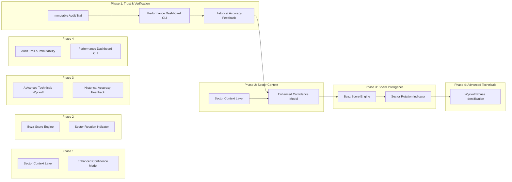

# Option A: Deepen Research + Ratings

> **Goal**: Extend the existing Aeternus Scoring Pipeline to deliver richer, more actionable investment intelligence.

---

## Background

### Current Implementation (Phase 0)

| Component | File | What It Does |
|-----------|------|--------------|
| `AeternusScorer` | [aeternus_scoring.py](file:///Users/aeternusholdings/Documents/AeternusAgentsAG/tradingagents/graph/aeternus_scoring.py) | Derives a 0–100 score from 5 weighted dimensions (fundamental 30%, technical 25%, macro 20%, sentiment 15%, momentum 10%) and returns an `AeternusRating`. |
| `TrackRecord` | [track_record.py](file:///Users/aeternusholdings/Documents/AeternusAgentsAG/tradingagents/graph/track_record.py) | Logs ratings to JSON, computes basic stats, and calculates win_rate/avg_return. |
| CLI `score` | [main.py](file:///Users/aeternusholdings/Documents/AeternusAgentsAG/cli/main.py) | `aeternus score AAPL` command runs minimal analysis and outputs table/JSON. |

### What's Missing (Per PLATFORM_VISION.md)

The vision document (Pillar 1 & 3) outlines many features we haven't built yet:
- **"Buzz Score"** — Real-time social momentum indicator
- **Sector/Industry Scoring** — Peer comparisons and sector rotation model
- **Wyckoff Phase Identification** — Advanced technical analysis
- **Confidence Factors** — Data Quality, Thesis Clarity, Catalyst Proximity
- **Historical Accuracy** — Track record on similar calls influencing confidence
- **Rating History Audit Trail** — Immutable history with P&L calculations

---

## Proposed Enhancements

We will enhance the Research + Ratings pillar in **four phases**:



---

## Phase 1: Trust & Verification (Performance Tracking) ✅ COMPLETED

> **Goal**: Evaluate the system's accuracy to build investor trust before adding new complexities.

### 1.1 Immutable Audit Trail

**Objective**: Ratings should never be deleted—only updated with full history.

#### [MODIFY] [track_record.py](file:///Users/aeternusholdings/Documents/AeternusAgentsAG/tradingagents/graph/track_record.py)

- Add `uuid` to each rating.
- Implement `append_event` instead of overwriting the list.
- Store "Rating Created", "Rating Updated", "Trade Closed" events.

#### [NEW] [audit.py](file:///Users/aeternusholdings/Documents/AeternusAgentsAG/tradingagents/graph/audit.py)

```python
class RatingAuditLog:
    """Immutable audit log for all rating events."""
    
    def log_event(self, event_type: str, rating_id: str, data: dict):
        """Log rating creation, update, or outcome."""
        ...
    
    def get_rating_history(self, rating_id: str) -> list[dict]:
        """Get all events for a rating."""
        ...
```

### 1.2 Performance Dashboard CLI

**Objective**: Add CLI commands to view track record and performance.

#### [MODIFY] [main.py](file:///Users/aeternusholdings/Documents/AeternusAgentsAG/cli/main.py)

Add new commands:

```python
@app.command()
def track_record(
    ticker: str = typer.Option(None, help="Filter by ticker"),
    format: str = typer.Option("table", help="Output format: table or json"),
):
    """View rating history and performance statistics."""
    ...

@app.command()
def performance(
    format: str = typer.Option("table", help="Output format: table or json"),
):
    """Show win rate, average return, and rating distribution."""
    ...
```

### 1.3 Feedback Loop (Historical Accuracy)

**Objective**: Use past accuracy to inform future confidence.

#### [MODIFY] [track_record.py](file:///Users/aeternusholdings/Documents/AeternusAgentsAG/tradingagents/graph/track_record.py)

Add methods:

```python
def get_accuracy_for_setup(self, setup_type: str) -> float:
    """Return historical win rate for similar setups."""
    ...

def get_accuracy_by_confidence(self, confidence_level: int) -> float:
    """Return win rate for ratings at a given confidence level."""
    ...
```

---

## Phase 2: Sector Context Integration

> **Goal**: Integrate the already-built Sector Context module into the scoring engine.

### 2.1 Integrate Sector Context

**Objective**: Connect `SectorContext` to `AeternusScorer`.

#### [NEW] [sector_context.py](file:///Users/aeternusholdings/Documents/AeternusAgentsAG/tradingagents/graph/sector_context.py)

```python
class SectorContext:
    """Provides sector/industry data and peer comparison."""
    
    def __init__(self, market_data_source):
        self.market_data = market_data_source
    
    def get_sector(self, ticker: str) -> str:
        """Return sector classification (GICS)."""
        ...
    
    def get_peers(self, ticker: str, n: int = 5) -> list[str]:
        """Return top N peers by market cap in same sector."""
        ...
    
    def get_sector_metrics(self, sector: str) -> dict:
        """Return avg P/E, avg ROE, sector momentum, etc."""
        ...
    
    def relative_valuation(self, ticker: str) -> dict:
        """Compare ticker valuation to sector averages."""
        ...
```

**Integration**:
- `AeternusScorer.score()` will call `SectorContext` to add `sector`, `peer_comparison`, and `relative_valuation` to the output.

### 2.2 Enhanced Confidence Model

**Objective**: Replace the simple 1–5 confidence with a multi-factor model.

#### [MODIFY] [aeternus_scoring.py](file:///Users/aeternusholdings/Documents/AeternusAgentsAG/tradingagents/graph/aeternus_scoring.py)

Add new fields to `AeternusRating`:

```python
class AeternusRating(TypedDict):
    # ... existing fields ...
    confidence_factors: ConfidenceFactors  # NEW
    sector: str                            # NEW
    peer_comparison: dict                  # NEW

class ConfidenceFactors(TypedDict):
    data_quality: int       # 0-100: How complete is the data?
    thesis_clarity: int     # 0-100: How clear is the investment thesis?
    catalyst_proximity: int # 0-100: How near-term are catalysts?
    historical_accuracy: int # 0-100: Track record on similar calls
```

**Calculation**:
```
CONFIDENCE = weighted average of:
├── Data Quality (30%) — completeness of reports
├── Thesis Clarity (25%) — LLM self-evaluation
├── Catalyst Proximity (25%) — time to catalyst
└── Historical Accuracy (20%) — from TrackRecord
```

---

## Phase 2: Buzz Score + Sector Rotation

### 2.1 Buzz Score Engine

**Objective**: Create a real-time "social momentum" indicator.

#### [NEW] [buzz_score.py](file:///Users/aeternusholdings/Documents/AeternusAgentsAG/tradingagents/graph/buzz_score.py)

```python
class BuzzScoreEngine:
    """Calculate social momentum (0-100) from sentiment data."""
    
    def __init__(self, sentiment_analyzer):
        self.sentiment = sentiment_analyzer
    
    def compute(self, ticker: str, lookback_hours: int = 24) -> dict:
        """
        Returns:
            {
                "buzz_score": 75,
                "mentions_count": 1234,
                "sentiment_delta": +0.15,  # vs 7-day avg
                "top_sources": ["twitter", "reddit"],
                "trend": "rising"
            }
        """
        ...
```

**Integration**:
- Add `buzz_score` to `AeternusRating` output.
- Weight can be toggled in config (default 0% until validated).

---

### 2.2 Sector Rotation Indicator

**Objective**: Identify which sectors are in favor based on business cycle and momentum.

#### [NEW] [sector_rotation.py](file:///Users/aeternusholdings/Documents/AeternusAgentsAG/tradingagents/graph/sector_rotation.py)

```python
class SectorRotationModel:
    """Maps economic indicators to sector recommendations."""
    
    def get_cycle_phase(self) -> str:
        """Return current business cycle phase: early, mid, late, recession."""
        ...
    
    def get_sector_rankings(self) -> list[dict]:
        """
        Return sectors ranked by attractiveness.
        [{"sector": "Technology", "score": 85, "trend": "rising"}, ...]
        """
        ...
    
    def get_risk_regime(self) -> str:
        """Return 'risk-on' or 'risk-off'."""
        ...
```

---

## Phase 3: Advanced Technical + Historical Accuracy

### 3.1 Wyckoff Phase Identification

**Objective**: Add Wyckoff accumulation/distribution phase detection.

#### [NEW] [wyckoff_analyzer.py](file:///Users/aeternusholdings/Documents/AeternusAgentsAG/tradingagents/graph/wyckoff_analyzer.py)

```python
class WyckoffAnalyzer:
    """Identify Wyckoff phases from price/volume data."""
    
    def identify_phase(self, ticker: str, lookback_days: int = 90) -> dict:
        """
        Returns:
            {
                "phase": "accumulation",  # or markup, distribution, markdown
                "confidence": 0.85,
                "spring_detected": True,
                "volume_profile": "increasing",
                "support_levels": [145.50, 142.00],
                "resistance_levels": [155.00, 160.00]
            }
        """
        ...
```

**Integration**:
- Feed Wyckoff output into the `technical_score` calculation.
- Optionally add `wyckoff_phase` to `AeternusRating`.

---

### 3.2 Historical Accuracy Feedback Loop

**Objective**: Use past rating outcomes to adjust future confidence.

#### [MODIFY] [track_record.py](file:///Users/aeternusholdings/Documents/AeternusAgentsAG/tradingagents/graph/track_record.py)

Add methods:

```python
def get_accuracy_for_setup(self, setup_type: str) -> float:
    """
    Return historical win rate for similar setups.
    E.g., "momentum_buy" or "value_contrarian".
    """
    ...

def get_accuracy_by_sector(self, sector: str) -> float:
    """Return win rate for a specific sector."""
    ...

def get_accuracy_by_confidence(self, confidence_level: int) -> float:
    """Return win rate for ratings at a given confidence level."""
    ...
```

**Integration**:
- `ConfidenceFactors.historical_accuracy` will be populated from these methods.

---

## Phase 4: Audit Trail + Dashboard

### 4.1 Immutable Audit Trail

**Objective**: Ratings should never be deleted—only updated with full history.

#### [MODIFY] [track_record.py](file:///Users/aeternusholdings/Documents/AeternusAgentsAG/tradingagents/graph/track_record.py)

- Add `update_rating()` method that appends a new version rather than overwriting.
- Add `rating_id` (UUID) to each rating for reference.
- Store `previous_rating_id` for linked history.

#### [NEW] [audit.py](file:///Users/aeternusholdings/Documents/AeternusAgentsAG/tradingagents/graph/audit.py)

```python
class RatingAuditLog:
    """Immutable audit log for all rating events."""
    
    def log_event(self, event_type: str, rating_id: str, data: dict):
        """Log rating creation, update, or outcome."""
        ...
    
    def get_rating_history(self, rating_id: str) -> list[dict]:
        """Get all events for a rating."""
        ...
```

---

### 4.2 Performance Dashboard CLI

**Objective**: Add CLI commands to view track record and performance.

#### [MODIFY] [main.py](file:///Users/aeternusholdings/Documents/AeternusAgentsAG/cli/main.py)

Add new commands:

```python
@app.command()
def track_record(
    ticker: str = typer.Option(None, help="Filter by ticker"),
    format: str = typer.Option("table", help="Output format: table or json"),
):
    """View rating history and performance statistics."""
    ...

@app.command()
def performance(
    format: str = typer.Option("table", help="Output format: table or json"),
):
    """Show win rate, average return, and rating distribution."""
    ...
```

---

## Summary Table

| Phase | Feature | New Files | Modified Files |
|-------|---------|-----------|----------------|
| 1 | Sector Context Layer | `sector_context.py` | `aeternus_scoring.py` |
| 1 | Enhanced Confidence Model | — | `aeternus_scoring.py` |
| 2 | Buzz Score Engine | `buzz_score.py` | `aeternus_scoring.py` |
| 2 | Sector Rotation Indicator | `sector_rotation.py` | — |
| 3 | Wyckoff Analyzer | `wyckoff_analyzer.py` | `aeternus_scoring.py` |
| 3 | Historical Accuracy Feedback | — | `track_record.py` |
| 4 | Immutable Audit Trail | `audit.py` | `track_record.py` |
| 4 | Performance Dashboard CLI | — | `main.py` |

---

## Verification Plan

### Automated Tests

For each new module, we will add:

```bash
# Sector Context
pytest tests/test_sector_context.py -v

# Buzz Score
pytest tests/test_buzz_score.py -v

# Wyckoff
pytest tests/test_wyckoff.py -v

# Audit Trail
pytest tests/test_audit.py -v

# CLI Commands
pytest tests/test_cli_track_record.py -v
```

### Manual Verification

1. Run `aeternus score AAPL --format json` and verify new fields appear.
2. Run `aeternus track-record` and verify history output.
3. Run `aeternus performance` and verify stats.

---

## Recommended Implementation Order

1. **Phase 1** (Sector + Confidence) — Foundational, unlocks peer comparison.
2. **Phase 4** (Audit + Dashboard) — Important for transparency and trust.
3. **Phase 2** (Buzz + Rotation) — Adds social intelligence.
4. **Phase 3** (Wyckoff + Historical Accuracy) — Advanced, can iterate later.

---

> **Next Step**: Confirm this architecture, then I will create a detailed task checklist and begin implementation.
